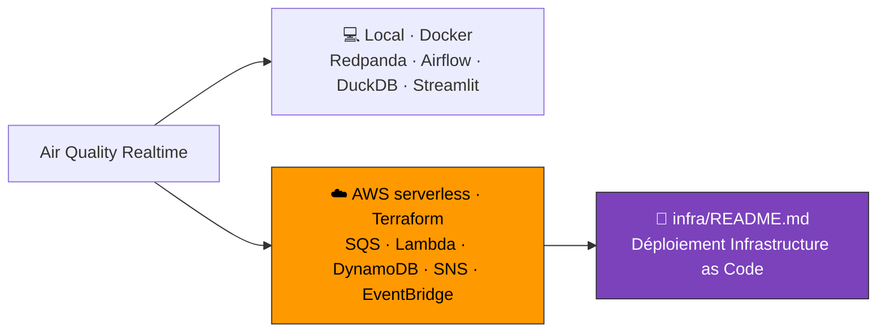

# Air Quality Realtime — Pipeline de données temps réel

[](https://www.python.org/)
[](https://docs.astral.sh/uv/)
[](https://redpanda.com/)
[](https://airflow.apache.org/)
[](https://duckdb.org/)
[](https://www.snowflake.com/)
[](https://streamlit.io/)
[](https://www.docker.com/)
[](https://www.terraform.io/)
[](https://aws.amazon.com/)
[](https://docs.astral.sh/ruff/)
[](https://docs.pytest.org/)

Surveillance en quasi temps réel de la qualité de l'air urbain : détection et
alerte sur les dépassements de seuils OMS à partir d'un flux continu de capteurs.

Projet portfolio orienté **data engineering temps réel** : streaming, traitement
de flux, entrepôt cloud et visualisation, le tout conteneurisé.


## Architecture (hybride : streaming + batch)

```
 CHEMIN STREAMING (temps réel)
┌──────────────┐  air-quality-raw   ┌───────────────┐  air-quality-alerts  ┌─────────────┐
│   Producer   │ ─────────────────► │   Processor   │ ───────────────────► │  Dashboard  │
│ SimulatedSrc │     (Redpanda)     │ (détection    │      (Redpanda)      │ (Streamlit) │
│ haute fréq.  │                    │  d'alertes)   │                      └─────────────┘
└──────────────┘                    └──────┬────────┘
                                            │
 CHEMIN BATCH (orchestré)                   ▼
┌──────────────┐   horaire          ┌──────────────────────┐
│   Airflow    │ ─────────────────► │  DuckDB (local)      │  entrepôt OLAP
│  DAG horaire │  Open-Meteo réel   │  -> Snowflake (prod, │  (cf. docs/
│ + qualité    │  -> chargement     │     documenté)       │   snowflake-deployment.md)
└──────────────┘                    └──────────────────────┘
```

Deux chemins complémentaires : un **flux temps réel** (capteurs simulés haute
fréquence -> détection d'alertes -> dashboard) et un **chemin batch orchestré
par Airflow** (ingestion horaire des vraies données Open-Meteo -> Snowflake +
contrôles qualité). La source de données est interchangeable
(`SimulatedSource` / `OpenMeteoSource`) via une abstraction commune.

## Stack technique

| Brique            | Techno                          | Rôle                                        |
|-------------------|---------------------------------|---------------------------------------------|
| Bus de messages   | Redpanda (compatible Kafka)     | Transport des flux temps réel               |
| Client streaming  | confluent-kafka (Python)        | Produire / consommer les messages           |
| Source réelle     | API Open-Meteo (httpx)          | Vraies concentrations (gratuit, sans clé)   |
| Orchestration     | Apache Airflow                  | DAG batch : ingestion horaire + qualité     |
| Traitement        | Python                          | Stats glissantes, détection de seuils       |
| Entrepôt          | DuckDB (local) / Snowflake      | Stockage analytique colonnaire (OLAP)       |
| Visualisation     | Streamlit                       | Tableau de bord live                        |
| Config / qualité  | pydantic-settings, ruff, pytest | Config typée, lint, tests                   |
| Conteneurisation  | Docker / docker-compose         | Reproductibilité, déploiement               |
| IaC / Cloud       | Terraform + AWS serverless      | Déploiement managé (SQS, Lambda, DynamoDB, SNS, EventBridge) — cf. [`infra/`](infra/README.md) |
| Gestion de projet | uv                              | Environnement et dépendances                |

## Prérequis

- [uv](https://docs.astral.sh/uv/) (gestion d'environnement Python)
- Docker + docker-compose (pour Redpanda et le déploiement)

## Démarrage rapide

```bash
# 1. Installer l'environnement (crée .venv et installe les dépendances)
uv sync

# 2. Outils de dev (lint + tests)
uv sync --group dev

# 3. Copier la config d'exemple
cp .env.example .env
```

### Lancer Redpanda et le producer

> Selon ta version de Docker, la commande est `docker compose` (V2) ou
> `docker-compose` (V1, avec tiret). Les exemples ci-dessous utilisent la V2 ;
> remplace par `docker-compose` si besoin. Le script `create_topics.sh` détecte
> automatiquement la bonne commande.

```bash
# 1. Démarrer le broker Redpanda + la console web
docker compose -f docker/docker-compose.yml up -d

# 2. Créer les topics (une seule fois)
bash scripts/create_topics.sh

# 3. Lancer le producer (publie sur le topic air-quality-raw)
uv run aq-producer

# 3 bis. Dans un AUTRE terminal : lancer le processor (détecte et alerte)
uv run aq-processor

# 3 ter. Dans un AUTRE terminal : lancer le sink (persiste dans DuckDB)
uv run aq-sink

# Vérifier le contenu de l'entrepôt :
uv run python scripts/query_duckdb.py

# 3 quater. Le dashboard temps réel (lecture seule, auto-refresh 5 s)
uv run streamlit run src/air_quality_realtime/dashboard/app.py
# -> http://localhost:8501

# 4. Vérifier les messages :
#    - via la console web : http://localhost:8080  (onglet Topics)
#    - ou en CLI :
docker compose -f docker/docker-compose.yml exec redpanda-0 \
  rpk topic consume air-quality-raw -n 5

# Arrêt (et suppression des données) :
docker compose -f docker/docker-compose.yml down -v
```

### Tout lancer en conteneurs (une seule commande)

Toute la stack (Redpanda + console + producer + processor + sink + dashboard)
peut démarrer ensemble. Les services applicatifs partagent une image unique
(`docker/Dockerfile`) et se connectent au broker via le listener **interne**
`redpanda-0:9092`.

```bash
# Construire les images et tout démarrer
docker compose -f docker/docker-compose.yml up -d --build

# (Première fois / volume vierge uniquement) créer les topics partitionnés :
bash scripts/create_topics.sh

# Accès :
#   - Dashboard        : http://localhost:8501
#   - Console Redpanda : http://localhost:8080

# Suivre les logs d'un service
docker compose -f docker/docker-compose.yml logs -f processor

# Tout arrêter (garde les données) / tout supprimer (-v efface les volumes)
docker compose -f docker/docker-compose.yml down
docker compose -f docker/docker-compose.yml down -v
```

> Mode développement (hot reload, itération rapide) : on garde Redpanda en
> conteneur et on lance producer/processor/sink/dashboard via `uv run` sur
> l'hôte (voir plus haut). Mode démo/portfolio : tout en conteneurs.

## Déploiement cloud — AWS serverless (Terraform)

En plus de la stack locale Docker, le pipeline est déployable sur **AWS en
serverless**, entièrement décrit en **Terraform** (Infrastructure as Code) et
**100 % free tier**. L'architecture streaming locale (Redpanda · Airflow ·
DuckDB) y est transposée vers des services managés.



➡️ **Documentation complète du déploiement : [`infra/README.md`](infra/README.md)**

L'étape suivante (DAG Airflow) est documentée dans le journal de bord.

## Structure du projet

```
air-quality-realtime/
├── src/air_quality_realtime/
│   ├── common/      # config et utilitaires partagés
│   ├── producer/    # simulateur de capteurs -> Redpanda
│   ├── processor/   # détection d'alertes sur le flux
│   └── sink/        # chargement vers Snowflake
├── docker/          # Dockerfiles + docker-compose
├── infra/           # déploiement AWS serverless (Terraform) — voir infra/README.md
├── scripts/         # scripts utilitaires (création de topics, etc.)
├── tests/           # tests unitaires
├── data/            # données locales (non versionnées)
└── pyproject.toml   # dépendances gérées par uv
```
